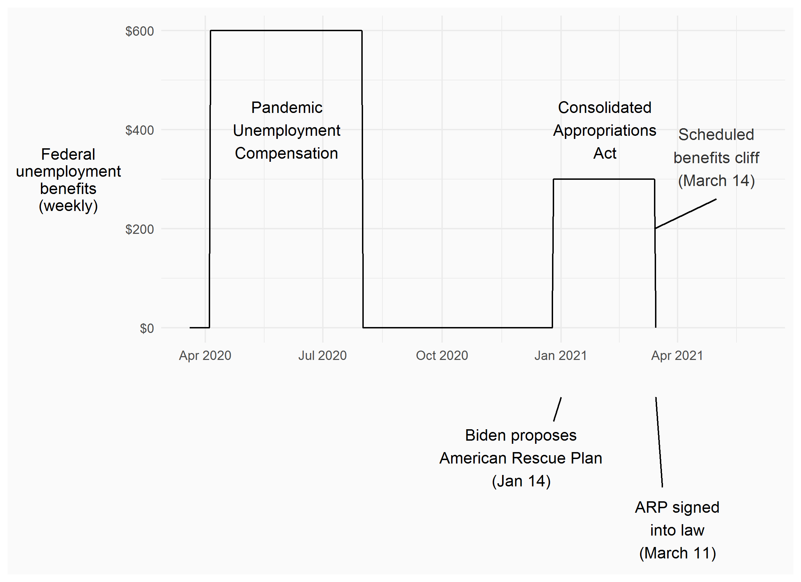
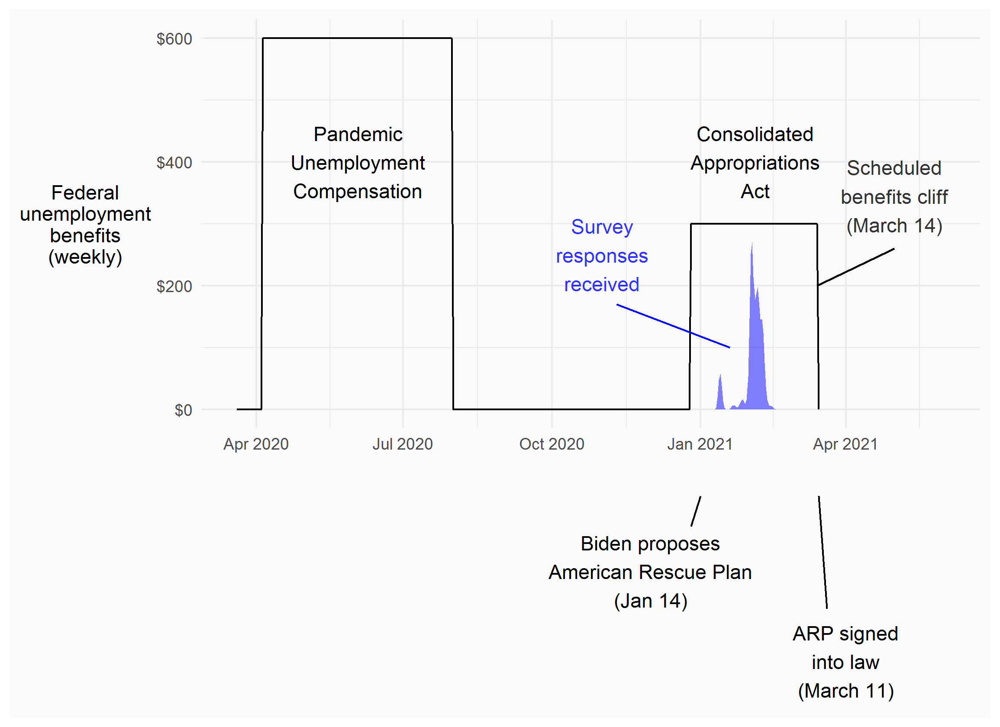

```{R, setup, include = F}
options(htmltools.dir.version = FALSE)
library(pacman)
p_load(
  broom, here, tidyverse,xaringan,
  latex2exp, ggplot2, ggthemes, viridis, extrafont, gridExtra,
  kableExtra,tinytex,stargazer,formattable,
  dplyr, magrittr, knitr, parallel, tufte,emo, ggrepel, sf, hrbrthemes, lwgeom, maps, mapdata, spData,leaflet
)
# Define pink color
red_pink <- "#e64173"
turquoise <- "#20B2AA"
grey_light <- "grey70"
grey_mid <- "grey50"
grey_dark <- "grey20"
# Dark slate grey: #314f4f
# Knitr options
opts_chunk$set(
  comment = "#>",
  fig.align = "center",
  fig.height = 7,
  fig.width = 10.5,
  warning = F,
  message = F
)
options(device = function(file, width, height) {
  svg(tempfile(), width = width, height = height)
})
# A blank theme for ggplot
theme_empty <- theme_bw() + theme(
  line = element_blank(),
  rect = element_blank(),
  strip.text = element_blank(),
  axis.text = element_blank(),
  plot.title = element_blank(),
  axis.title = element_blank(),
  plot.margin = structure(c(0, 0, -0.5, -1), unit = "lines", valid.unit = 3L, class = "unit"),
  legend.position = "none"
)
theme_simple <- theme_bw() + theme(
  line = element_blank(),
  panel.grid = element_blank(),
  rect = element_blank(),
  strip.text = element_blank(),
  axis.text.x = element_text(size = 18, family = "STIXGeneral"),
  axis.text.y = element_blank(),
  axis.ticks = element_blank(),
  plot.title = element_blank(),
  axis.title = element_blank(),
  # plot.margin = structure(c(0, 0, -1, -1), unit = "lines", valid.unit = 3L, class = "unit"),
  legend.position = "none"
)
theme_axes_math <- theme_void() + theme(
  text = element_text(family = "MathJax_Math"),
  axis.title = element_text(size = 22),
  axis.title.x = element_text(hjust = .95, margin = margin(0.15, 0, 0, 0, unit = "lines")),
  axis.title.y = element_text(vjust = .95, margin = margin(0, 0.15, 0, 0, unit = "lines")),
  axis.line = element_line(
    color = "grey70",
    size = 0.25,
    arrow = arrow(angle = 30, length = unit(0.15, "inches")
  )),
  plot.margin = structure(c(1, 0, 1, 0), unit = "lines", valid.unit = 3L, class = "unit"),
  legend.position = "none"
)
theme_axes_serif <- theme_void() + theme(
  text = element_text(family = "MathJax_Main"),
  axis.title = element_text(size = 22),
  axis.title.x = element_text(hjust = .95, margin = margin(0.15, 0, 0, 0, unit = "lines")),
  axis.title.y = element_text(vjust = .95, margin = margin(0, 0.15, 0, 0, unit = "lines")),
  axis.line = element_line(
    color = "grey70",
    size = 0.25,
    arrow = arrow(angle = 30, length = unit(0.15, "inches")
  )),
  plot.margin = structure(c(1, 0, 1, 0), unit = "lines", valid.unit = 3L, class = "unit"),
  legend.position = "none"
)
theme_axes <- theme_void() + theme(
  text = element_text(family = "Fira Sans Book"),
  axis.title = element_text(size = 18),
  axis.title.x = element_text(hjust = .95, margin = margin(0.15, 0, 0, 0, unit = "lines")),
  axis.title.y = element_text(vjust = .95, margin = margin(0, 0.15, 0, 0, unit = "lines")),
  axis.line = element_line(
    color = grey_light,
    size = 0.25,
    arrow = arrow(angle = 30, length = unit(0.15, "inches")
  )),
  plot.margin = structure(c(1, 0, 1, 0), unit = "lines", valid.unit = 3L, class = "unit"),
  legend.position = "none"
)

# class: inverse, center, middle
# count: false

```


# Introduction

--

**Background**

--

- Significant political polarization in US

--

- Major disagreement over the role of government in providing for those in need

--

- Pandemic policies affect employment rates, increasing reliance on social safety net

--

- Extent of social safety net may affect support for pandemic mitigation strategies 

---

# Introduction

--

**Research question**: 

How does national social safety net affect support for local pandemic policies?

--

**Method**: 

Choice experiment with randomized pandemic scenarios and policies

--

**Significance**: 

Political polarization has no end in sight. The next pandemic may be just around the corner.

---

# Stated choice experiment
  
--

- Before the consent page...

  - Basic demographic screening information, including zip codes
  - Qualtrics passively collects device type, date and time
  - Can link location with local pandemic history

--

- Survey instrument

  - Short update on county and national covid conditions
  - Description of choice task
  - Referendum-style vote on hypothetical pandemic policies
  
--

- 993 participants from Washington, Oregon and California, collected Jan 13 - Feb 16, 2021
  
--

- Policies described in terms of:

  - Context: duration and federal safety net
  - Reduction in cases, deaths
  - Restrictions on 10 categories of businesses/activities
  - Increased unemployment and resulting loss in income


---


# Stated choice experiment
  

- Before the consent page...

  - Basic demographic screening information, including zip codes
  - Qualtrics passively collects device type, date and time
  - Can link location with local pandemic history


- Survey instrument

  - Short update on county and national covid conditions
  - Description of choice task
  - Referendum-style vote on hypothetical pandemic policies
  

- 993 participants from Washington, Oregon and California, collected Jan 13 - Feb 16, 2021

- Policies described in terms of:

  - Context: duration and **federal safety net**
  - Reduction in cases, deaths
  - Restrictions on 10 categories of businesses/activities
  - **Increased unemployment and resulting loss in income**

---

# US Federal benefits


<center>

</center>


---

# US Federal benefits


<center>

</center>


---

# US Federal benefits


<center>

</center>

---

# The debate


<center>

</center>

---

# The debate


<center>

</center>

---

# The debate


<center>

</center>

---

# The debate


<center>

</center>

---

# The debate


<center>

</center>

---

# The debate


<center>

</center>

---

# The debate


<center>

</center>

---

# The debate


<center>

</center>


---

# The other debate

<br>

<center>

</center>


---

# The other debate

<br>

<center>

</center>

--

Are these preferences related?

---


# Instructions to respondents

--

Respondents did not get to vote on Federal UI payments:

> **Assume that any Federal unemployment benefits, as described, will be in place regardless of any pandemic rules that apply in [respondent's] County.**

--

We emphasized that costs/unemployment would be uncertain, unequal, and related:

> These “Average $/month lost” because of a policy are mostly a RESULT of unemployment and lost business
earnings. They are not an extra cost on top of that.

> Before a policy is adopted, we don't know exactly who will bear costs that are higher or lower than the
average. **Your own household's actual cost per month will be uncertain.**


---

# Choice task: preamble

<center>

</center>

---

# Choice task: attributes

<center>

</center>

---

# Choice task: attributes

<center>

</center>

---

# Choice task: modals

<center>

</center>

---

# Choice task: vote

<br>

<center>

</center>

---

# Selection correction

--

Variables retained: LASSO selection equation

<center>

</center>

---

# Selected results

```{r echo=FALSE}

res0 <- read.csv("~/covid-survey/presentations/results-table.csv")
res0[,4:5] <- ""
res0[2:13,2:3] <- ""


names(res0) <- c("","(1)","(2)","(1')","(2')")


kbl(res0,align=c("l","c","c","c","c")) %>%
  kable_classic(
    bootstrap_options = c("condensed"),html_font="\"Arial\""
    ) %>%
  row_spec(0:13,
           font_size = 14,bold=T) %>%
  column_spec(1,width="1.5in") %>%
  column_spec(2:5,width="1in") %>%
  row_spec(6, extra_css = "border-bottom: 1px solid") %>%
  row_spec(12, extra_css = "border-bottom: 1px solid")

```

Model (1) treats business restrictions as continuous. Model (2) uses indicator variables for business restrictions. All models include cases, deaths, and de-meaned response propensity interactions. (N = 1,986 pairwise choices)

---

# Selected results

```{r echo=FALSE}

res1 <- read.csv("~/covid-survey/presentations/results-table.csv")
res1[,4:5] <- ""
res1[7:13,2:5] <- ""

names(res1) <- c("","(1)","(2)","(1')","(2')")


kbl(res1,align=c("l","c","c","c","c")) %>%
  kable_classic(
    bootstrap_options = c("condensed"),html_font="\"Arial\""
    ) %>%
  row_spec(0:13,
           font_size = 14,bold=T) %>%
  column_spec(1,width="1.5in") %>%
  column_spec(2:5,width="1in") %>%
  row_spec(6, extra_css = "border-bottom: 1px solid") %>%
  row_spec(12, extra_css = "border-bottom: 1px solid") %>% 
  row_spec(5,color="red")

```

Model (1) treats business restrictions as continuous. Model (2) uses indicator variables for business restrictions. All models include cases, deaths, and de-meaned response propensity interactions. (N = 1,986 pairwise choices)

---

# Selected results

```{r echo=FALSE}

res1b <- read.csv("~/covid-survey/presentations/results-table.csv")
res1b[,4:5] <- ""

names(res1b) <- c("","(1)","(2)","(1')","(2')")


kbl(res1b,align=c("l","c","c","c","c")) %>%
  kable_classic(
    bootstrap_options = c("condensed"),html_font="\"Arial\""
    ) %>%
  row_spec(0:13,
           font_size = 14,bold=T) %>%
  column_spec(1,width="1.5in") %>%
  column_spec(2:5,width="1in") %>%
  row_spec(6, extra_css = "border-bottom: 1px solid") %>%
  row_spec(12, extra_css = "border-bottom: 1px solid") %>% 
  row_spec(5,color="red") %>% 
  row_spec(11,color="red")

```

Model (1) treats business restrictions as continuous. Model (2) uses indicator variables for business restrictions. All models include cases, deaths, and de-meaned response propensity interactions. (N = 1,986)

---

# Selected results

```{r echo=FALSE}


res2 <- read.csv("~/covid-survey/presentations/results-table.csv")

names(res2) <- c("","(1)","(2)","(1')","(2')")

kbl(res2,align=c("l","c","c","c","c")) %>%
  kable_classic(
    bootstrap_options = c("condensed"),html_font="\"Arial\""
    ) %>%
  row_spec(0:13,
           font_size = 14,bold=T) %>%
  column_spec(1,width="1.5in") %>%
  column_spec(2:5,width="1in") %>%
  row_spec(6, extra_css = "border-bottom: 1px solid") %>%
  row_spec(12, extra_css = "border-bottom: 1px solid") %>% 
  row_spec(5,color="red") %>% 
  row_spec(11,color="red")

```

Models (1) and (1') treat business restrictions as continuous. Models (2) and (2') use indicator variables for business restrictions. All models include cases, deaths, and de-meaned response propensity interactions. (N = 1,986)

---

# Heterogeneity

```{r echo=FALSE}

het1 <- read.csv("~/covid-survey/presentations/results-table-het.csv")

names(het1)[c(1,5,7,8)] <- c("","Non-white","<$75k/yr",">$75k/yr")

het1[,5:8] <- ""

kbl(het1,align=c("l","c","c","c","c","c","c","c")) %>%
  kable_classic(
    bootstrap_options = c("condensed"),html_font="\"Arial\""
    ) %>%
  row_spec(0:6,
           font_size = 14,bold=T)  %>%
  column_spec(1,width="2in",border_right=T) %>%
  column_spec(2:8,width="1in") %>%
  row_spec(5, extra_css = "border-bottom: 1px solid")
```

---

# Heterogeneity

```{r echo=FALSE}

het2 <- read.csv("~/covid-survey/presentations/results-table-het.csv")

names(het2)[c(1,5,7,8)] <- c("","Non-white","<$75k/yr",">$75k/yr")

het2[,7:8] <- ""

kbl(het2,align=c("l","c","c","c","c","c","c","c")) %>%
  kable_classic(
    bootstrap_options = c("condensed"),html_font="\"Arial\""
    ) %>%
  row_spec(0:6,
           font_size = 14,bold=T)  %>%
  column_spec(1,width="2in",border_right=T) %>%
  column_spec(2:8,width="1in") %>% 
  column_spec(4,border_right=T) %>%
  row_spec(5, extra_css = "border-bottom: 1px solid")
```

---

# Heterogeneity

```{r echo=FALSE}

het3 <- read.csv("~/covid-survey/presentations/results-table-het.csv")

names(het3)[c(1,5,7,8)] <- c("","Non-white","<$75k/yr",">$75k/yr")

kbl(het3,align=c("l","c","c","c","c","c","c","c")) %>%
  kable_classic(
    bootstrap_options = c("condensed"),html_font="\"Arial\""
    ) %>%
  row_spec(0:6,
           font_size = 14,bold=T)  %>% 
  column_spec(1,width="2in",border_right=T) %>%
  column_spec(2:8,width="1in") %>% 
  column_spec(c(4,6),border_right=T) %>%
  row_spec(5, extra_css = "border-bottom: 1px solid")
```

---

# Conclusion

- National policy context shapes local policy preferences

- Model has much better fit with Federal UI interactions

- Some folks care about the cost consequences; liberals want a policy regardless of the economic effects

Methodological stuff:

- Designed survey questions for population of 50,000 and dynamically adjusted figures for respondent's county

- Pop-ups to reduce cognitive burden

- Ad hoc (non-FIML) selection procedure for conditional logit
  - Simulates preference parameters for participant with mean response propensity from an invitee population that was represenative on observables


---

exclude: true

