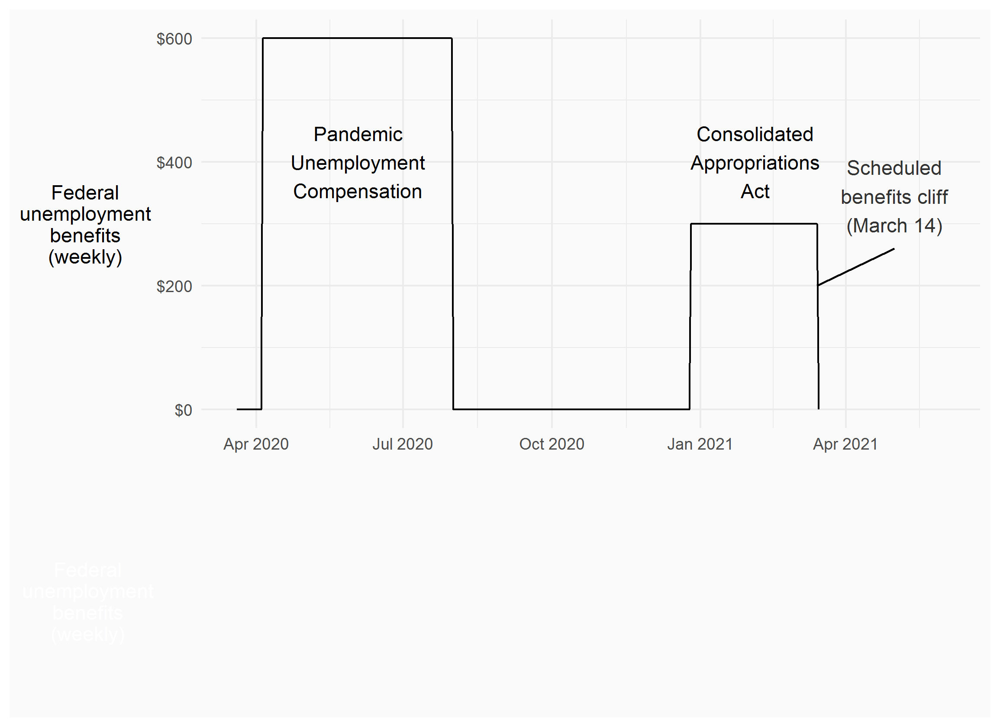

```{R, setup, include = F}
options(htmltools.dir.version = FALSE)
library(pacman)
p_load(
  broom, here, tidyverse,xaringan,
  latex2exp, ggplot2, ggthemes, viridis, extrafont, gridExtra,
  kableExtra,tinytex,
  dplyr, magrittr, knitr, parallel, tufte,emo, ggrepel, sf, hrbrthemes, lwgeom, maps, mapdata, spData,leaflet
)
# Define pink color
red_pink <- "#e64173"
turquoise <- "#20B2AA"
grey_light <- "grey70"
grey_mid <- "grey50"
grey_dark <- "grey20"
# Dark slate grey: #314f4f
# Knitr options
opts_chunk$set(
  comment = "#>",
  fig.align = "center",
  fig.height = 7,
  fig.width = 10.5,
  warning = F,
  message = F
)
options(device = function(file, width, height) {
  svg(tempfile(), width = width, height = height)
})
# A blank theme for ggplot
theme_empty <- theme_bw() + theme(
  line = element_blank(),
  rect = element_blank(),
  strip.text = element_blank(),
  axis.text = element_blank(),
  plot.title = element_blank(),
  axis.title = element_blank(),
  plot.margin = structure(c(0, 0, -0.5, -1), unit = "lines", valid.unit = 3L, class = "unit"),
  legend.position = "none"
)
theme_simple <- theme_bw() + theme(
  line = element_blank(),
  panel.grid = element_blank(),
  rect = element_blank(),
  strip.text = element_blank(),
  axis.text.x = element_text(size = 18, family = "STIXGeneral"),
  axis.text.y = element_blank(),
  axis.ticks = element_blank(),
  plot.title = element_blank(),
  axis.title = element_blank(),
  # plot.margin = structure(c(0, 0, -1, -1), unit = "lines", valid.unit = 3L, class = "unit"),
  legend.position = "none"
)
theme_axes_math <- theme_void() + theme(
  text = element_text(family = "MathJax_Math"),
  axis.title = element_text(size = 22),
  axis.title.x = element_text(hjust = .95, margin = margin(0.15, 0, 0, 0, unit = "lines")),
  axis.title.y = element_text(vjust = .95, margin = margin(0, 0.15, 0, 0, unit = "lines")),
  axis.line = element_line(
    color = "grey70",
    size = 0.25,
    arrow = arrow(angle = 30, length = unit(0.15, "inches")
  )),
  plot.margin = structure(c(1, 0, 1, 0), unit = "lines", valid.unit = 3L, class = "unit"),
  legend.position = "none"
)
theme_axes_serif <- theme_void() + theme(
  text = element_text(family = "MathJax_Main"),
  axis.title = element_text(size = 22),
  axis.title.x = element_text(hjust = .95, margin = margin(0.15, 0, 0, 0, unit = "lines")),
  axis.title.y = element_text(vjust = .95, margin = margin(0, 0.15, 0, 0, unit = "lines")),
  axis.line = element_line(
    color = "grey70",
    size = 0.25,
    arrow = arrow(angle = 30, length = unit(0.15, "inches")
  )),
  plot.margin = structure(c(1, 0, 1, 0), unit = "lines", valid.unit = 3L, class = "unit"),
  legend.position = "none"
)
theme_axes <- theme_void() + theme(
  text = element_text(family = "Fira Sans Book"),
  axis.title = element_text(size = 18),
  axis.title.x = element_text(hjust = .95, margin = margin(0.15, 0, 0, 0, unit = "lines")),
  axis.title.y = element_text(vjust = .95, margin = margin(0, 0.15, 0, 0, unit = "lines")),
  axis.line = element_line(
    color = grey_light,
    size = 0.25,
    arrow = arrow(angle = 30, length = unit(0.15, "inches")
  )),
  plot.margin = structure(c(1, 0, 1, 0), unit = "lines", valid.unit = 3L, class = "unit"),
  legend.position = "none"
)

# class: inverse, center, middle
# count: false

```


# Introduction

--

**Background**

--

- Significant political polarization in US

--

- Major disagreement over the role of government in providing for those in need

--

- Pandemic policies have significant short-term effects on employment rates, increasing reliance on social safety net

--

- Strength of social safety net may affect support for pandemic mitigation strategies 

---

# Introduction

--

**Research question**: How does national social safety net affect support for local pandemic policies?

--

**Method**: Choice experiment with randomized pandemic scenarios and policies

--

**Significance**: Political polarization is a problem with no end in sight. The next pandemic is just around the corner.

---


# Federal benefits

<br>

<center>

</center>


---

# Federal benefits

<br>

<center>

</center>


---

# Federal benefits

<br>

<center>

</center>

---

# The debate

<br>

<center>

</center>

---

# The debate

<br>

<center>

</center>

---

# The debate

<br>

<center>

</center>

---

# The debate

<br>

<center>

</center>

---

# The debate

<br>

<center>

</center>

---

# The debate

<br>

<center>

</center>

---

# The debate

<br>

<center>

</center>

---

# The debate

<br>

<center>

</center>


---

# The "debate"

<br>

<center>

</center>

---

# The debate

<center>

</center>

---

# Stated choice experiment
  
--

- Survey instrument

--

  - Short update on county and national covid conditions
  
--

  - Description of choice task

--

  - Referendum-style vote on hypothetical pandemic policies
  
--

- Policies described in terms of:

  - Duration

  - Reduction in cases
  
  - Reduction in deaths
  
  - Restrictions on 10 categories of businesses/activities
  
  - Increased unemployment and resulting loss in income

--

- 993 participants from Washington, Oregon and California, collected Jan 13 - Feb 16

---

exclude: true

