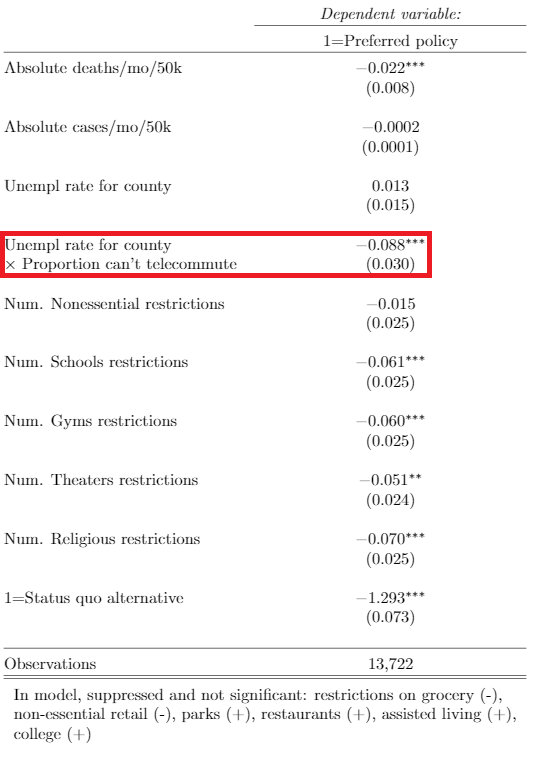
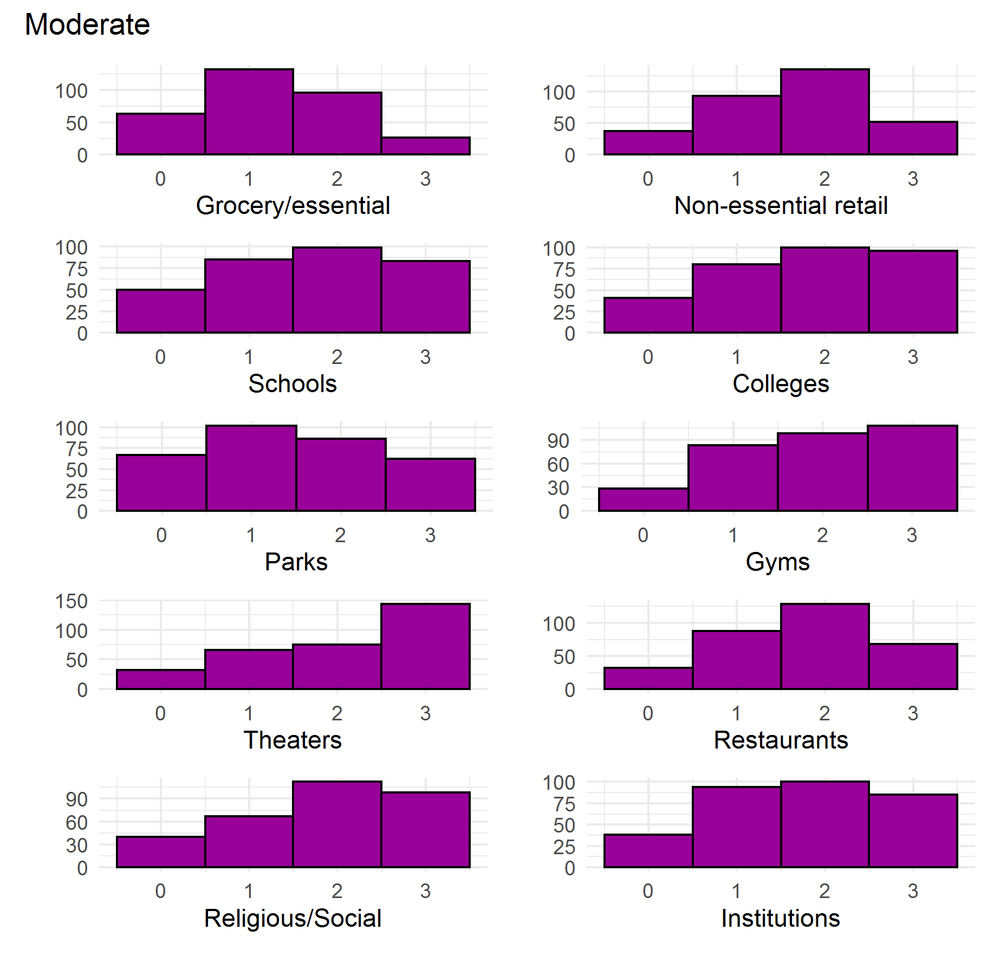

```{R, setup, include = F}
options(htmltools.dir.version = FALSE)
library(pacman)
p_load(
  broom, here, tidyverse,xaringan,
  latex2exp, ggplot2, ggthemes, viridis, extrafont, gridExtra,
  kableExtra,tinytex,
  dplyr, magrittr, knitr, parallel, tufte,emo, ggrepel, sf, hrbrthemes, lwgeom, maps, mapdata, spData,leaflet
)
# Define pink color
red_pink <- "#e64173"
turquoise <- "#20B2AA"
grey_light <- "grey70"
grey_mid <- "grey50"
grey_dark <- "grey20"
# Dark slate grey: #314f4f
# Knitr options
opts_chunk$set(
  comment = "#>",
  fig.align = "center",
  fig.height = 7,
  fig.width = 10.5,
  warning = F,
  message = F
)
options(device = function(file, width, height) {
  svg(tempfile(), width = width, height = height)
})
# A blank theme for ggplot
theme_empty <- theme_bw() + theme(
  line = element_blank(),
  rect = element_blank(),
  strip.text = element_blank(),
  axis.text = element_blank(),
  plot.title = element_blank(),
  axis.title = element_blank(),
  plot.margin = structure(c(0, 0, -0.5, -1), unit = "lines", valid.unit = 3L, class = "unit"),
  legend.position = "none"
)
theme_simple <- theme_bw() + theme(
  line = element_blank(),
  panel.grid = element_blank(),
  rect = element_blank(),
  strip.text = element_blank(),
  axis.text.x = element_text(size = 18, family = "STIXGeneral"),
  axis.text.y = element_blank(),
  axis.ticks = element_blank(),
  plot.title = element_blank(),
  axis.title = element_blank(),
  # plot.margin = structure(c(0, 0, -1, -1), unit = "lines", valid.unit = 3L, class = "unit"),
  legend.position = "none"
)
theme_axes_math <- theme_void() + theme(
  text = element_text(family = "MathJax_Math"),
  axis.title = element_text(size = 22),
  axis.title.x = element_text(hjust = .95, margin = margin(0.15, 0, 0, 0, unit = "lines")),
  axis.title.y = element_text(vjust = .95, margin = margin(0, 0.15, 0, 0, unit = "lines")),
  axis.line = element_line(
    color = "grey70",
    size = 0.25,
    arrow = arrow(angle = 30, length = unit(0.15, "inches")
  )),
  plot.margin = structure(c(1, 0, 1, 0), unit = "lines", valid.unit = 3L, class = "unit"),
  legend.position = "none"
)
theme_axes_serif <- theme_void() + theme(
  text = element_text(family = "MathJax_Main"),
  axis.title = element_text(size = 22),
  axis.title.x = element_text(hjust = .95, margin = margin(0.15, 0, 0, 0, unit = "lines")),
  axis.title.y = element_text(vjust = .95, margin = margin(0, 0.15, 0, 0, unit = "lines")),
  axis.line = element_line(
    color = "grey70",
    size = 0.25,
    arrow = arrow(angle = 30, length = unit(0.15, "inches")
  )),
  plot.margin = structure(c(1, 0, 1, 0), unit = "lines", valid.unit = 3L, class = "unit"),
  legend.position = "none"
)
theme_axes <- theme_void() + theme(
  text = element_text(family = "Fira Sans Book"),
  axis.title = element_text(size = 18),
  axis.title.x = element_text(hjust = .95, margin = margin(0.15, 0, 0, 0, unit = "lines")),
  axis.title.y = element_text(vjust = .95, margin = margin(0, 0.15, 0, 0, unit = "lines")),
  axis.line = element_line(
    color = grey_light,
    size = 0.25,
    arrow = arrow(angle = 30, length = unit(0.15, "inches")
  )),
  plot.margin = structure(c(1, 0, 1, 0), unit = "lines", valid.unit = 3L, class = "unit"),
  legend.position = "none"
)

# class: inverse, center, middle
# count: false

```

# Covid-19 rages on

--

US counties without Covid-19

--

<center>

</center>


---

# Research questions

--

- What kind of trade-offs are people willing to make between

--

  - Illness and lost lives
  
--

  - Reduced access to activities and businesses
  - Reduced employment and income
  
--

- What are the important sources of preference heterogeneity?

---

# Heterogeneity in preferences

<center>

</center>

---

# Heterogeneity in preferences

<center>

</center>

---

# Heterogeneity in preferences

<center>

</center>

---

# Stated choice experiment
  
--

- Survey instrument

--

  - Short update on local and national covid conditions
  
--

  - Description of choice task

--

  - Referendum-style vote on hypothetical pandemic policies
  
--

- Policies described in terms of:

  - Duration

  - Reduction in cases
  
  - Reduction in deaths
  
  - Restrictions on 10 categories of businesses/activities
  
  - Increased unemployment and resulting loss in income

--

- 1,029 participants from Washington, Oregon and California

---

# Sample policy

<center>

</center>

---

# Sample policy

<center>

</center>

---

<!-- # The role of culture -->

<!-- -- -->

<!-- - Washing facilities in Pakistan for Pathan tribeswomen (Dasgupta, 1995) -->

<!-- -- -->

<!--   - Women walked 8 km each way to wash clothes each week -->

<!-- -- -->

<!-- - Choose not to use washing facilities. Why? -->

<!-- -- -->

<!--   - Washing at the river provided a day-long opportunity for socializing -->

<!-- -- -->

<!-- - Knowledge of local culture and conditions can make or break a project -->

<!--   - This includes cultural attitudes and practices of consumers -->

<!-- -- -->

<!-- - Hypothesis: Culturally close project managers will be more sensitive to local culture and will have better project outcomes, all else equal. -->

<!-- --- -->

# Model

Individual $i$ chooses alternative (policy) $j \in \{A,B,N\}$, each with attributes (cases, deaths, restrictions, costs) $k \in 1,...,K$ such that


$V_{ij} = max\{V_{iA},V_{iB},V_{iN}\}$

where

$V_{ij} = \beta_1 \text{deaths}_{jk} + \beta_2\text{cases}_{jk} + \beta_3\text{cost}_{jk} + \sum_{k=4}^{13} \beta_k \text{restriction}_{jk} + \beta_NI_{j=N} + \eta_{ij}$


---

# Results

<center>

</center>

---

# Dimensions of heterogeneity

 <center>

</center>


---

# Dimensions of heterogeneity

 <center>

</center>


---

# Dimensions of heterogeneity

 <center>

</center>

---


# Ideal rules

 <center>

</center>

---

# Ideal rules

 <center>

</center>

---

# Ideal rules

 <center>

</center>

---

# Ideal rules

 <center>

</center>

---

# Ideal rules

 <center>

</center>

---

#Data: Project quality

<center>

</center>

Distribution of IEG ratings in estimating sample.

---

#Data: Institutional quality

- Measure of institutional quality is Country Policy and Institutional Assessment (CPIA)

- Four subscores:

--
  - Economic management 
  - Structural policies
  - Policies for social inclusion and equity
  - Public sector management and institutions
  
--

- CPIA is a widely used measure of institutional quality in the literature examining the effectiveness of foreign aid

---

#Data: Institutional quality

<center>

</center>

Distribution of CPIA ratings in estimating sample.

---

# Data: Cultural proximity

I use a two-step process to construct a novel measure of the cultural overlap between TTLs and recipient countries.

--
    
**Step 1**: Use the global distribution of each surname to construct a probabilistic estimate of each TTL's ancestral country. 

Data from **forebears.io**

--

How well does forebears.io perform?

--

- *Roy*: India (72%), followed by Bangladesh, and Canada
- *Chaturvedi*: India (92%), followed by U.A.E., and U.S.
- *Burlando*: Italy (66%), followed by Argentina, and U.S.

---

# Data: Cultural proximity

Spolaore and Wacziarg (2009, 2018) developed a measure of **ancestral distance** between countries.

--
   
**Step 2**: find the weighted average of the ancestral distance between 
- Each TTL's likely home countries
- The country in which their project takes place

--
   
*Negative* of this result is the estimated **cultural proximity** between the TTL and the recipient country.

<!-- --- -->
<!-- # Data: Cultural proximity -->

<!-- <center> -->
<!-- Burlandos of the world in % -->

<!--  -->
<!-- </center> -->


<!-- --- -->
<!-- # Data: Cultural proximity -->

<!-- <center> -->
<!-- Ancestral distance to Brazil  -->

<!--  -->
<!-- </center> -->


---

# Data: Cultural proximity

<center>

</center>

Alfredo Burlando's estimated cultural proximity to Brazil

\begin{align}
-(0.66 \times 0.62 + 0.2 \times 1.02 + 0.14 \times 1.4) = -0.81
\end{align}


---

exclude: true

