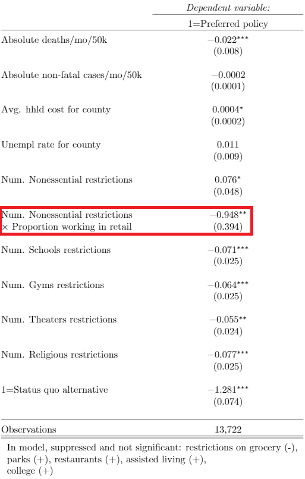

```{R, setup, include = F}
options(htmltools.dir.version = FALSE)
library(pacman)
p_load(
  broom, here, tidyverse,xaringan,
  latex2exp, ggplot2, ggthemes, viridis, extrafont, gridExtra,
  kableExtra,tinytex,
  dplyr, magrittr, knitr, parallel, tufte,emo, ggrepel, sf, hrbrthemes, lwgeom, maps, mapdata, spData,leaflet
)
# Define pink color
red_pink <- "#e64173"
turquoise <- "#20B2AA"
grey_light <- "grey70"
grey_mid <- "grey50"
grey_dark <- "grey20"
# Dark slate grey: #314f4f
# Knitr options
opts_chunk$set(
  comment = "#>",
  fig.align = "center",
  fig.height = 7,
  fig.width = 10.5,
  warning = F,
  message = F
)
options(device = function(file, width, height) {
  svg(tempfile(), width = width, height = height)
})
# A blank theme for ggplot
theme_empty <- theme_bw() + theme(
  line = element_blank(),
  rect = element_blank(),
  strip.text = element_blank(),
  axis.text = element_blank(),
  plot.title = element_blank(),
  axis.title = element_blank(),
  plot.margin = structure(c(0, 0, -0.5, -1), unit = "lines", valid.unit = 3L, class = "unit"),
  legend.position = "none"
)
theme_simple <- theme_bw() + theme(
  line = element_blank(),
  panel.grid = element_blank(),
  rect = element_blank(),
  strip.text = element_blank(),
  axis.text.x = element_text(size = 18, family = "STIXGeneral"),
  axis.text.y = element_blank(),
  axis.ticks = element_blank(),
  plot.title = element_blank(),
  axis.title = element_blank(),
  # plot.margin = structure(c(0, 0, -1, -1), unit = "lines", valid.unit = 3L, class = "unit"),
  legend.position = "none"
)
theme_axes_math <- theme_void() + theme(
  text = element_text(family = "MathJax_Math"),
  axis.title = element_text(size = 22),
  axis.title.x = element_text(hjust = .95, margin = margin(0.15, 0, 0, 0, unit = "lines")),
  axis.title.y = element_text(vjust = .95, margin = margin(0, 0.15, 0, 0, unit = "lines")),
  axis.line = element_line(
    color = "grey70",
    size = 0.25,
    arrow = arrow(angle = 30, length = unit(0.15, "inches")
  )),
  plot.margin = structure(c(1, 0, 1, 0), unit = "lines", valid.unit = 3L, class = "unit"),
  legend.position = "none"
)
theme_axes_serif <- theme_void() + theme(
  text = element_text(family = "MathJax_Main"),
  axis.title = element_text(size = 22),
  axis.title.x = element_text(hjust = .95, margin = margin(0.15, 0, 0, 0, unit = "lines")),
  axis.title.y = element_text(vjust = .95, margin = margin(0, 0.15, 0, 0, unit = "lines")),
  axis.line = element_line(
    color = "grey70",
    size = 0.25,
    arrow = arrow(angle = 30, length = unit(0.15, "inches")
  )),
  plot.margin = structure(c(1, 0, 1, 0), unit = "lines", valid.unit = 3L, class = "unit"),
  legend.position = "none"
)
theme_axes <- theme_void() + theme(
  text = element_text(family = "Fira Sans Book"),
  axis.title = element_text(size = 18),
  axis.title.x = element_text(hjust = .95, margin = margin(0.15, 0, 0, 0, unit = "lines")),
  axis.title.y = element_text(vjust = .95, margin = margin(0, 0.15, 0, 0, unit = "lines")),
  axis.line = element_line(
    color = grey_light,
    size = 0.25,
    arrow = arrow(angle = 30, length = unit(0.15, "inches")
  )),
  plot.margin = structure(c(1, 0, 1, 0), unit = "lines", valid.unit = 3L, class = "unit"),
  legend.position = "none"
)

# class: inverse, center, middle
# count: false

```

background-color: #FFFFFF

# Covid-19 rages on

--

The spread of Covid-19 across the US

<center>

</center>

Circle size indicates new cases, 7-day average.
---

background-color: #FFFFFF

# Covid-19 rages on


The spread of Covid-19 across the US

<center>

</center>

Circle size indicates new cases, 7-day average.
---

# Research questions

--

- What kind of trade-offs are people willing to make between

--

  - Illness and lost lives
  
--

  - Reduced access to activities and businesses
  - Reduced employment and income
  
--

- What are the important sources of preference heterogeneity?

---

# Heterogeneity in preferences

<br>

<center>

</center>

---

# Heterogeneity in preferences

<br>

<center>

</center>

---

# Heterogeneity in preferences

<center>

</center>

---

# Stated choice experiment
  
--

- Survey instrument

--

  - Short update on county and national covid conditions
  
--

  - Description of choice task

--

  - Referendum-style vote on hypothetical pandemic policies
  
--

- Policies described in terms of:

  - Duration

  - Reduction in cases
  
  - Reduction in deaths
  
  - Restrictions on 10 categories of businesses/activities
  
  - Increased unemployment and resulting loss in income

--

- 1,029 participants from Washington, Oregon and California, collected Jan 13 - Feb 16

---

# Sample policy

<center>

</center>

---

# Sample policy

<center>

</center>

---

# Sample policy

<center>

</center>

---

# Sample policy

<center>

</center>
---


# Model

Individual $i$ chooses alternative (policy) $j \in \{A,N\}$, each with attributes (cases, deaths, restrictions, costs) $k \in 1,...,K$ such that


$V_{ij} = max\{V_{iA},V_{iN}\}$

where

$V_{ij} = \beta_1 \text{deaths}_{jk} + \beta_2\text{cases}_{jk} + \beta_3\text{cost}_{jk} + \sum_{k=4}^{13} \beta_k \text{restriction}_{jk} + \beta_NI_{j=N} + \eta_{ij}$

--

If $i$ chooses $A$, then we know:

$V_{iA} - V_{iN} = \Delta X_{AN}'\beta + \eta_{iA} - \eta_{iN} > 0$ 


If $\eta_{ij}$ is distributed Type I extreme value, then $(\eta_{iA} - \eta_{iN})$ has a logistic distribution, so we use conditional logit to estimate the parameters in the indirect utility function.

---

# A note on sampling

--

- Our sample is stratified to be representative in terms of age, race, gender and income

--

- Individuals are weighted so that sample is representative in terms of state of residence

--

- Demographic and location data on non-respondents permits selection correction

---

# Results

<center>

</center>

---

# Dimensions of heterogeneity

 <center>

</center>


---

# Dimensions of heterogeneity

 <center>

</center>

---

# Dimensions of heterogeneity

 <center>

</center>

---

# Political ideology

--

 <center>

</center>

---

# Political ideology


 <center>

</center>

---

# Ideal rules

 <center>

</center>

---

# Ideal rules

 <center>

</center>

---

# Ideal rules

 <center>

</center>

---

# Ideal rules

 <center>

</center>

---

# Ideal rules

 <center>

</center>

---

# Political ideology

 <center>

</center>

---

# Political ideology & Fed UI

 <center>

</center>

---

# Political ideology & Fractionalization

 <center>

</center>

---

# Trade offs

In a county with a population of 50,000...

--

For conservatives:

- A life is worth about 63 jobs (lives vs. livelihoods)

- Keeping church fully open is worth about 15 lives

--

For liberals:

- Keeping parks  open is worth about 2 lives

- Keeping theaters and arts spaces open is worth about 1.5 lives

--

For moderates:

- Keeping gyms open is worth about 125 cases

---

# Other results

- You've had covid -> *less* concerned with cases

--

- Friend/family had covid -> nothing

--

- You *or* friend/family has comorbidities -> more concerned with cases


---

# Other dimensions 

- Federal unemployment insurance

- Household members by age group

- Race/ethnicity, gender

- Rural/urban, state effects

- Income (household/county)

- Subjective perception of $R_0$

- Housing tenure and duration

- Employment status

---

# Conclusion

--

- Research innovations: 

  - County-level public policies, rather than private choices
  - Multiple categories of benefits and costs
  - Digestible visual display of complex policy attributes
  - Personalizing choice scenarios by county characteristics
  - Correcting consumer panel for selection on unobservables
  - (Delivering tailored, randomized designs anonymously)

--

- Substantive results concerning pandemic policies:

  - Covid-19 probably not last pandemic
  - It's more than just lives vs. livelihoods
  - Which tradeoffs matter to different constituencies
  - Which cost measures are most salient ($, unemployment, and restrictions)
  - Which benefit measures are most salient (avoided cases, avoided premature death)

---

# Everything

External data by county and ZIP code

Historical daily counts of COVID-19 cases and deaths, by county
Bureau of Labor Statistics unemployment estimates, by county
Census sociodemographic characteristics, by county and by ZCTA
Census employment sectors, by ZCTA
Urban-rural population proportions, by county and by ZCTA
Presidential election voting patterns in 2016, by county

Screening questions (linked by zip code to external data)
State of residence: CA, OR, WA
Metadata: Operating system (mobile, computer)
Age bracket
Gender
Race
Household income bracket
ZIP code (thus county, county population)

---

# Everything (cont.)

Subjective county preparedness for pandemic
Subjective burden of past pandemic restrictions
Answers to several comprehension questions
Millisecs per survey page and per word
Clicks on page (per pop-up option)
Dependence on restricted activities/services
   For income, for access
Extra Federal weekly unemployment benefits
   $0, 100, 200, 300, 400
Certainty about stated policy choices
Reasons for choosing No Policy
For stated "ideal" restrictions
   What maximum cases tolerated?
   What maximum deaths tolerated?
   What maximum unempl rate tolerated?
Household members by age group
   0-1, 2-5, 6-12, 13-17, 18-64, 65+
Marital status
Family or friends institutionalized?
Dependence on public transit pre-COVID
Duration of residence in county
   <2, 3-5, 6-10, >10 years
Expected future stay in county
   <2, 3-5, 6-10, >10 years  
   
---

# Everything (cont.)

List of specific personal comorbidities
List of comorbidities for family, friends
Subjective perception of R0
Vulnerability by group membership
Subjective access to medical care
Expected duration of pandemic
Race, Ethnicity
Own current employment status
Personal housing tenure
Educational attainment
Household income reduced by COVID?
Household jobs lost to COVID?
Lost jobs with recall expected?
Assessment of Federal govt response?
Expectations about new administration?
Subjective perception of researcher bias?

---

exclude: true

